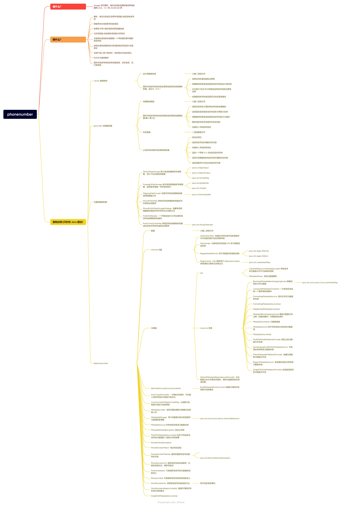

### 三方库设计说明

#### 1 需求场景分析

一个解析、格式化和验证国际电话号码的通用 Java、C++ 和 JavaScript 库

#### 2 三方库对外提供的特性

（1） 解析、格式化和验证世界所有国家/地区的电话号码

#### 3 License分析

MIT License

|  Permissions   | Limitations  |
|  ----  | ----  |
| Commercial use |  |
| Modification  |   |
| Distribution  |   |
| Patent  use   |   |
| Private use   |   |

#### 4 依赖分析 

依赖

Java 库：java.io.ObjectInput、java.io.ObjectOutput、java.util.SortedMap、java.nio.ByteBuffer、java.util.TreeSet、java.util.StringTokenizer、java.util.regex.Matcher、java.util.regex.Pattern、java.util.LinkedHashMap、java.util.concurrent.ConcurrentHashMap、java.util.concurrent.atomic.AtomicReference、java.lang.Character.UnicodeBlock

#### 5 特性设计文档

##### 5.1 核心特性1 

###### 5.1.1 特性介绍

    解析、格式化和验证世界所有国家/地区的电话号码。可以根据号码本身获取号码的类型，为所有国家/地区提供有效的示例号码，仅使用长度信息快速猜测一个号码是否是可能的电话号码，使用长度和前缀信息对区域的电话号码进行全面验证等等。

###### 5.1.2 实现方案
    获取 PhoneNumberUtil 的 getInstance 实例，校验号码前需要通过 号码字符串 + 国家代号 来解析成国际通过的号码，通过 format 方法对解析后的号码按不同标准进行格式化，通过 isPossibleNumber 方法来验证手机号的有效性

###### 5.1.3 接口设计

💡 carrier.PhoneNumberToCarrierMapper.cj 提供与电话号码相关的运营商信息的电话前缀映射器

| 成员函数 | 入参 | 返回值 | 作用描述 |
| --- | --- |  --- | --- |
| init   | phonePrefixDataDirectory: String | --- | PhoneNumberToCarrierMapper 的有参构造器，phonePrefixDataDirectory: 传入 String 类型字符串 |
| getInstance   | --- | PhoneNumberToCarrierMapper | 获取实例以执行国际运营商查询 |
| getNameForValidNumber   | number: PhoneNumber，languageCode: Locale | String | 以提供的语言返回给定电话号码的运营商名称，number: 一个有效的电话号码，languageCode: 名称应使用的语言代码 |
| getNameForNumber   | number: PhoneNumber，languageCode: Locale | String | 以提供的语言返回给定电话号码的运营商名称，number: 想要获取运营商名称的电话号码，languageCode: 名称应使用的语言代码 |
| getSafeDisplayName   | number: PhoneNumber，languageCode: Locale | String | 仅在向用户显示“安全”时获取给定电话号码的运营商名称，想要获取运营商名称的电话号码，languageCode: 名称应使用的语言代码 |
| isMobile   | numberType: PhoneNumberType | Bool | 检查提供的号码类型是否支持运营商查找，numberType: 传入 PhoneNumberType 类型 |

💡 geocoder.geocoding.PhoneNumberOfflineGeocoder.cj 提供与电话号码相关的地理信息的离线地理编码器

| 成员函数 | 入参 | 返回值 | 作用描述 |
| --- | --- |  --- | --- |
| init   | phonePrefixDataDirectory: String | --- | PhoneNumberOfflineGeocoder 的有参构造器，phonePrefixDataDirectory: 传入 String 类型字符串 |
| getInstance   | --- | PhoneNumberOfflineGeocoder | 获取实例以执行地理编码查询 |
| getCountryNameForNumber   | number: PhoneNumber，languageCode: Locale | String | 返回电话号码所在地区的给定语言的惯用显示名称，number: 一个有效的电话号码，languageCode: 名称应使用的语言代码 |
| getRegionDisplayName   | regionCode: String，languageCode: Locale | String | 返回给定区域的给定语言的习惯显示名称，regionCode: String 类型字符串，language: 指定语言 |
| getDescriptionForValidNumber   | number: PhoneNumber，languageCode: Locale | String | 以提供的语言返回给定电话号码的文本描述，number: 传入 PhoneNumber 类型，languageCode: 名称应使用的语言代码 |
| getDescriptionForValidNumber   | number: PhoneNumber，languageCode: Locale，userRegion: String | String | 以提供的语言返回给定电话号码的文本描述，number: 想要获取文本描述的电话号码，languageCode: 应该为其编写描述的语言代码，userRegion: 给定用户的区域代码 |
| getDescriptionForNumber   | number: PhoneNumber，languageCode: Locale | String | 返回给定区域的给定语言的习惯显示名称但明确检查传入号码的有效性，number: 想要获取文本描述的电话号码，languageCode: 名称应使用的语言代码 |
| getDescriptionForNumber   | number: PhoneNumber，languageCode: Locale，userRegion: String | String | 返回给定区域的给定语言的习惯显示名称但明确检查传入号码的有效性，number: 想要获取文本描述的电话号码，languageCode: 名称应使用的语言代码，userRegion: 给定用户的区域代码 |

💡 geocoder.timezones.PhoneNumberToTimeZonesMapper.cj 从电话号码到时区的离线映射器

| 成员函数 | 入参 | 返回值 | 作用描述 |
| --- | --- |  --- | --- |
| init   | prefixTimeZonesMapDataDirectory: String | --- | PhoneNumberToTimeZonesMapper 的有参构造器，prefixTimeZonesMapDataDirectory: 传入 String 类型字符串 |
| init   | PrefixTimeZonesMap: prefixTimeZonesMap | --- | PhoneNumberToTimeZonesMapper 的有参构造器，PrefixTimeZonesMap: 传入 prefixTimeZonesMap 类 |
| loadPrefixTimeZonesMapFromFile   | path: String | PrefixTimeZonesMap | 根据文件加载离线映射器，path: 传入文件路径 |
| close   | in: InputStream | --- | 关闭输入流，in: 传入输入流 |
| getInstance   | --- | PhoneNumberToTimeZonesMapper | 获取 PhoneNumberToTimeZonesMapper 实例 |
| getTimeZonesForGeographicalNumber   | number: PhoneNumber | ArrayList<String> | 返回电话号码所属的时区列表，number: 传入 PhoneNumber 类型 |
| getTimeZonesForNumber   | number: PhoneNumber | ArrayList<String> | 返回电话号码所属的时区列表但明确检查传入号码的有效性，number: 想要获取文本描述的电话号码 |
| getUnknownTimeZone   | --- | String | 返回一个带有 ICU 未知时区的字符串 |
| getTimeZonesForGeocodableNumber   | number: PhoneNumber | ArrayList<String> | 返回可地理编码的电话号码所属的时区列表，number: 想要获取文本描述的电话号码 |
| getCountryLevelTimeZonesforNumber   | number: PhoneNumber | ArrayList<String> | 返回的国家呼叫代码对应的时区列表，number: 想要获取文本描述的电话号码 |

💡 internal.DefaultMapStorage.cj 用于不包含重复描述的数据的默认电话前缀映射存储策略

| 成员函数 | 入参 | 返回值 | 作用描述 |
| --- | --- |  --- | --- |
| init   | --- | --- | DefaultMapStorage 的无参构造器 |
| getPrefix   | index: Int64 | Int64 | 获取前缀，index: 下标位置 |
| getDescription   | index: Int64 | String | 获取描述，index: 下标位置 |
| readFromSortedMap   | sortedPhonePrefixMap: SortedMap<Integer, String> | --- | 读数据，sortedPhonePrefixMap: 排序前缀 map 集合 |
| readExternal   | objectInput: ObjectInput | --- | 从外部读数据，objectInput: 对象输入流 |
| writeExternal   | objectOutput: ObjectOutput | --- | 写数据，objectOutput: 对象输出流 |

💡 internal.FlyweightMapStorage.cj 享元电话前缀映射存储策略，使用表来存储唯一的字符串，并在可能的情况下存储前缀和描述索引

| 成员函数 | 入参 | 返回值 | 作用描述 |
| --- | --- |  --- | --- |
| getPrefix   | index: Int64 | Int64 | 获取前缀，index: 下标位置 |
| getDescription   | index: Int64 | String | 获取描述，index: 下标位置 |
| readFromSortedMap   | sortedPhonePrefixMap: SortedMap<Integer, String> | --- | 读数据，sortedPhonePrefixMap: 排序前缀 map 集合 |
| createDescriptionPool   | descriptionsSet: SortedSet<String>，phonePrefixMap: SortedMap<Integer, String> | --- | 从提供的一组字符串描述和电话前缀映射创建描述池，descriptionsSet: 描述 set 集合，phonePrefixMap: 电话前缀 map 集合 |
| readExternal   | objectInput: ObjectInput | --- | 从外部读数据，objectInput: 对象输入流 |
| writeExternal   | objectOutput: ObjectOutput | --- | 写数据，objectOutput: 对象输出流 |
| readEntries   | objectInput: ObjectInput | --- | 从提供的输入流中读取电话前缀条目并将它们存储到内部字节缓冲区，objectInput: 对象输入流 |
| getOptimalNumberOfBytesForValue   | value: Int64 | Int64 | 获取可用于存储提供的最小字节数，value: Int64 类型 |
| readExternalWord   | objectInput: ObjectInput，wordSize: Int64，outputBuffer: ByteBuffer，index: Int64 | --- | 从提供读取的值存储到指定的字节，objectInput: 读取值的对象输入流，wordSize: 用于存储从流中读取的值的字节数，outputBuffer: 存储值的字节缓冲区，index: 值所在的索引 |
| writeExternalWord   | objectOutput: ObjectOutput，wordSize: Int64，outputBuffer: ByteBuffer，index: Int64 | --- | 从指定处提供的字节写入提供读取的值，objectInput: 读取值的对象输出流，wordSize: 用于存储从流中读取的值的字节数，outputBuffer: 存储值的字节缓冲区，index: 值所在的索引 |
| readWordFromBuffer   | buffer: ByteBuffer，wordSize: Int64，index: Int64 | Int64 | 从提供的字节中读取指定的值，buffer: 读取值的字节缓冲区，wordSize: 用于存储值的字节数，index: 从中读取值的索引 |
| storeWordInBuffer   | buffer: ByteBuffer，wordSize: Int64，index: Int64，value: Int64 | --- | 使用提供的以字节为单位将提供的，buffer: 读取值的字节缓冲区，wordSize: 用于存储值的字节数，index: 从中读取值的索引 |

💡 internal.MappingFileProvider.cj 一个实用程序，它知道可供电话前缀映射器使用的数据文件

| 成员函数 | 入参 | 返回值 | 作用描述 |
| --- | --- |  --- | --- |
| init   | --- | --- | MappingFileProvider 的无参构造器 |
| readFileConfigs   | availableDataFiles: SortedMap<Integer, Set<String>> | --- | 数据初始化，availableDataFiles: 从国家/地区呼叫代码到特定国家/地区呼叫代码可用数据文件的语言集的映射 |
| readExternal   | objectInput: ObjectInput | --- | 从外部读数据，objectInput: 对象输入流 |
| writeExternal   | objectOutput: ObjectOutput | --- | 写数据，objectOutput: 对象输出流 |
| toString   | --- | String | 返回表示此类中数据的字符串 |
| getFileName   | countryCallingCode: Int64, language: String, script: String, region: String  | String | 获取包含指定语言的映射数据的文件的名称，countryCallingCode: 数据文件包含的电话号码的国家/地区呼叫代码, language: 语言代码, script: 四个字符的标题, region: 两个字母大写 |
| findBestMatchingLanguageCode   | ---  | String | --- |
| onlyOneOfScriptOrRegionIsEmpty   | script: String, region: String  | Bool | --- |
| constructFullLocale   | language: String, script: String, region: String  | StringBuilder | --- |
| appendSubsequentLocalePart   | subsequentLocalePart: String，fullLocale: StringBuilder  | --- | --- |

💡 internal.PhonePrefixMap.cj 将电话号码前缀映射到描述字符串的实用程序

| 成员函数 | 入参 | 返回值 | 作用描述 |
| --- | --- |  --- | --- |
| init   | --- | --- | PhonePrefixMap 的无参构造器 |
| getPhonePrefixMapStorage   | --- | PhonePrefixMapStorageStrategy | --- |
| getSizeOfPhonePrefixMapStorage   | mapStorage: PhonePrefixMapStorageStrategy，phonePrefixMap: SortedMap<Integer, String> | Int64 | 获取提供的电话前缀映射存储的大小，mapStorage: 前缀 map 集合，phonePrefixMap: 一个 map 集合 |
| createDefaultMapStorage   | --- | PhonePrefixMapStorageStrategy | --- |
| createFlyweightMapStorage   | --- | PhonePrefixMapStorageStrategy | --- |
| getSmallerMapStorage   | phonePrefixMap: SortedMap<Integer, String> | PhonePrefixMapStorageStrategy | 根据提供的电话前缀映射获取较小的电话前缀映射存储策略，phonePrefixMap: map 集合 |
| readPhonePrefixMap   | sortedPhonePrefixMap: SortedMap<Integer, String>  | --- | 创建一个初始化的 map 集合，phonePrefixMap: map 集合 |
| readExternal   | objectInput: ObjectInput | --- | 从外部读数据，objectInput: 对象输入流 |
| writeExternal   | objectOutput: ObjectOutput | --- | 写数据，objectOutput: 对象输出流 |
| lookup   | number: Int64 | --- | 返回 codenumber 的描述，number: 要查找的电话号码 |
| lookup   | number: PhoneNumber | String | 将号码作为 PhoneNumber 而不是 Int64 接收，number: 要查找的电话号码 |
| binarySearch   | start: Int64，end: Int64，value: Int64 | Int64 | 二分法查找，如果找到，则返回位置 |
| toString   | --- | String | 转储电话前缀映射中包含的映射 |

💡 internal.PhonePrefixMapStorageStrategy.cj 抽象电话前缀数据存储到内存中并序列化为流的方式

| 成员函数 | 入参 | 返回值 | 作用描述 |
| --- | --- |  --- | --- |
| getPrefix   | index: Int64 | Int64 | 获取位于提供的的电话号码前缀，index: 需要返回的前缀的索引 |
| getDescription   | index: Int64 | String | 获取与位于提供的电话号码前缀相对应的描述 |
| readFromSortedMap   | sortedPhonePrefixMap: SortedMap<Integer, String> | --- | 从提供的将电话号码前缀映射到描述字符串的设置底层存储实现的内部状态，sortedPhonePrefixMap: 将电话号码前缀（包括国家/地区呼叫代码）映射到描述字符串的排序映射 |
| readExternal   | objectInput: ObjectInput | --- | 从外部读数据，objectInput: 对象输入流 |
| writeExternal   | objectOutput: ObjectOutput | --- | 写数据，objectOutput: 对象输出流 |
| getNumOfEntries   | --- | Int64 | 电话前缀映射中包含的条目数 |
| getPossibleLengths   | --- | TreeSet<Integer> | 包含可能的前缀长度的集合 |
| toString   | --- | String | --- |

💡 internal.PrefixFileReader.cj 进行文件处理和电话号码前缀映射查找的助手类

| 成员函数 | 入参 | 返回值 | 作用描述 |
| --- | --- |  --- | --- |
| init   | phonePrefixDataDirectory: String | --- | PrefixFileReader 的有参构造器 |
| loadMappingFileProvider   | --- | --- | --- |
| getPhonePrefixDescriptions   | --- | PhonePrefixMap | --- |
| loadPhonePrefixMapFromFile   | fileName: String | --- | --- |
| close   | in: InputStream | --- | 关闭输入流 |
| getDescriptionForNumber   | number: PhoneNumber，language: String，script: String，region: String | String | 返回给定电话号码的给定语言的文本描述，number: 想要获取文本描述的电话号码，language: 两个或三个字母的小写语言代码，script: 四字母大写，region: 两个字母大写 |
| mayFallBackToEnglish   | lang: String | Bool | --- |

💡 internal.PrefixTimeZonesMap.cj 将电话号码前缀映射到描述每个前缀所属时区的字符串列表的实用程序

| 成员函数 | 入参 | 返回值 | 作用描述 |
| --- | --- |  --- | --- |
| readPrefixTimeZonesMap   | sortedPrefixTimeZoneMap: SortedMap<Integer, String> | --- | --- |
| readExternal   | objectInput: ObjectInput | --- | 从外部读数据，objectInput: 对象输入流 |
| writeExternal   | objectOutput: ObjectOutput | --- | 写数据，objectOutput: 对象输出流 |
| lookupTimeZonesForNumber   | key: Int64 | ArrayList<String> | 返回对应的时区列表，key: 查找键 |
| lookupTimeZonesForNumber   | number: PhoneNumber | ArrayList<String> | --- |
| lookupCountryLevelTimeZonesForNumber   | number: PhoneNumber | ArrayList<String> | --- |
| tokenizeRawOutputString   | timezonesString: String | ArrayList<String> | --- |
| toString   | --- | String | --- |

💡 GeoEntityUtility.cj 用于检查标识符区域代码和国家呼叫代码是否属于地理实体的实用程序类

| 成员函数 | 入参 | 返回值 | 作用描述 |
| --- | --- |  --- | --- |
| isGeoEntity   | regionCode: String | Bool | 确定是否属于地理实体 |
| isGeoEntity   | countryCallingCode: Int64 | Bool | 确定是否属于地理实体 |

💡 MatcherApi.cj 内部电话号码匹配 API 用于隔离匹配器的底层实现，并允许轻松交换不同的实现

| 成员函数 | 入参 | 返回值 | 作用描述 |
| --- | --- |  --- | --- |
| matchNationalNumber   | number: CharSequence, numberDesc: PhoneNumberDesc, allowPrefixMatch: Bool | Bool | 返回给定的国家号码是否匹配 |

💡 RegexBasedMatcher.cj 用 PhoneNumberDesc 原型消息中的正则表达式实现匹配器 API 以匹配数字

| 成员函数 | 入参 | 返回值 | 作用描述 |
| --- | --- |  --- | --- |
| RegexBasedMatcher   | --- | --- | RegexBasedMatcher 的无参构造器 |
| matchNationalNumber   | number: CharSequence, numberDesc: PhoneNumberDesc, allowPrefixMatch: Bool | Bool | 返回给定的国家号码是否匹配 |
| match   | number: CharSequence, pattern: Pattern, allowPrefixMatch: Bool | Bool | --- |

💡 RegexCache.cj LRU 缓存用于 libphonenumbers 库使用的已编译正则表达式

| 成员函数 | 入参 | 返回值 | 作用描述 |
| --- | --- |  --- | --- |
| RegexCache   | size: Int64 | --- | RegexCache 的有参构造器，size: Int64 类型 |
| getPatternForRegex   | regex: String | Pattern | --- |
| getPatternForRegex   | regex: String | Bool | --- |
| get   | K: Key | V | --- |
| put   | K: Key，value: V | --- | --- |
| containsKey   | K: Key | Bool | --- |

💡 LRUCache.cj LRU 缓存用于 libphonenumbers 库使用的已编译正则表达式

| 成员函数 | 入参 | 返回值 | 作用描述 |
| --- | --- |  --- | --- |
| init   | size: Int64 | --- | LRUCache 的有参构造器，size: Int64 类型 |
| getPatternForRegex   | regex: String | Pattern | --- |
| removeEldestEntry   | eldest: Map.Entry<K, V> | Bool | --- |

💡 ClassPathResourceMetadataLoader.cj 将电话号码元数据文件作为类路径资源读取

| 成员函数 | 入参 | 返回值 | 作用描述 |
| --- | --- |  --- | --- |
| loadMetadata   | metadataFileName: String | InputStream | --- |

💡 MetadataParser.cj 将流内容解析为元数据的单一方法

| 成员函数 | 入参 | 返回值 | 作用描述 |
| --- | --- |  --- | --- |
| init   | strictMode: Bool | --- | MetadataParser 的有参构造器 |
| newLenientParser   | --- | MetadataParser | 在宽松模式下创建新实例 |
| newStrictParser   | --- | MetadataParser | 以严格模式创建新实例 |
| parse   | source: InputStream | Collection<PhoneMetadata> | 将流内容解析为元数据 |
| handleNullSource   | --- | ArrayList<PhoneMetadata> | --- |
| close   | in: InputStream | --- | 关闭输入流 |

💡 BlockingMetadataBootstrappingGuard.cj 阻塞实现。可用于单文件（批量）和多文件元数据

| 成员函数 | 入参 | 返回值 | 作用描述 |
| --- | --- |  --- | --- |
| init   | metadataLoader: MetadataLoader, metadataParser: MetadataParser, metadataContainer: T | --- | BlockingMetadataBootstrappingGuard 的有参构造器 |
| getOrBootstrap   | phoneMetadataFile: String | T | --- |
| bootstrapMetadata   | phoneMetadataFile: String | --- | --- |
| read   | phoneMetadataFile: String | Collection<PhoneMetadata> | --- |

💡 CompositeMetadataContainer.cj 是不同元数据容器的组合

| 成员函数 | 入参 | 返回值 | 作用描述 |
| --- | --- |  --- | --- |
| getMetadataBy   | regionCode: String | PhoneMetadata | 仅用于地理区域，regionCode: 地理编码 |
| getMetadataBy   | countryCallingCode: Int64 | PhoneMetadata | 仅适用于非地理实体 |
| accept   | phoneMetadata: PhoneMetadata | --- | 如果元数据属于特定地理区域，它将被添加到按区域代码存储元数据的容器中|

💡 FormattingMetadataSource.cj 格式化电话元数据的来源

| 成员函数 | 入参 | 返回值 | 作用描述 |
| --- | --- |  --- | --- |
| getFormattingMetadataForCountryCallingCode   | countryCallingCode: Int64 | PhoneMetadata | 返回提供的国家/地区呼叫代码的格式化电话元数据，countryCallingCode: 国家呼叫代码 |

💡 FormattingMetadataSourceImpl.cj 格式化电话元数据的来源

| 成员函数 | 入参 | 返回值 | 作用描述 |
| --- | --- |  --- | --- |
| init | phoneMetadataFileNameProvider: PhoneMetadataFileNameProvider, bootstrappingGuard: MetadataBootstrappingGuard<MapBackedMetadataContainer<Integer>> |  --- | FormattingMetadataSourceImpl 的有参构造器 |
| init | phoneMetadataFileNameProvider: PhoneMetadataFileNameProvider, metadataLoader: MetadataLoader，metadataParser: MetadataParser |  --- | FormattingMetadataSourceImpl 的有参构造器 |
| getFormattingMetadataForCountryCallingCode   | countryCallingCode: Int64 | PhoneMetadata | 返回提供的国家/地区呼叫代码的格式化电话元数据，countryCallingCode: 国家呼叫代码 |

💡 MapBackedMetadataContainer.cj 通用元数据容器

| 成员函数 | 入参 | 返回值 | 作用描述 |
| --- | --- |  --- | --- |
| init | keyProvider: KeyProvider<T> |  --- | MapBackedMetadataContainer 的有参构造器 |
| byRegionCode | --- |  MapBackedMetadataContainer<String> | --- |
| byCountryCallingCode | --- |  MapBackedMetadataContainer<Integer> | --- |
| getMetadataBy | key: T |  PhoneMetadata | --- |
| getKeyProvider | --- | KeyProvider<T> | --- |
| accept | phoneMetadata: PhoneMetadata | --- | --- |

💡 KeyProvider<T>.cj

| 成员函数 | 入参 | 返回值 | 作用描述 |
| --- | --- |  --- | --- |
| getKeyOf | phoneMetadata: PhoneMetadata | T | --- |

💡 MetadataBootstrappingGuard.cj 确保每个元数据文件仅触发一次元数据引导过程（加载和解析）的保护

| 成员函数 | 入参 | 返回值 | 作用描述 |
| --- | --- |  --- | --- |
| getOrBootstrap | phoneMetadataFile: String | T | 如果提供的文件中的元数据尚未被读取，则从提供的文件调用加载和解析，并将结果添加到受保护的容器中，phoneMetadataFile: 元数据文件 |

💡 MetadataContainer.cj 元数据容器

| 成员函数 | 入参 | 返回值 | 作用描述 |
| --- | --- |  --- | --- |
| accept | phoneMetadata: PhoneMetadata | --- | 将元数据添加到容器中，phoneMetadata: 元数据 |

💡 MetadataSource.cj 按不同区域划分的电话元数据源

| 成员函数 | 入参 | 返回值 | 作用描述 |
| --- | --- |  --- | --- |

💡 MetadataSourceImpl.cj 受保护的数据源实现类

| 成员函数 | 入参 | 返回值 | 作用描述 |
| --- | --- |  --- | --- |
| init | phoneMetadataFileNameProvider: PhoneMetadataFileNameProvider, bootstrappingGuard: MetadataBootstrappingGuard<CompositeMetadataContainer> |  --- | MetadataSourceImpl 的有参构造器 |
| init | phoneMetadataFileNameProvider: PhoneMetadataFileNameProvider, metadataLoader: MetadataLoader, metadataParser: MetadataParser |  --- | MetadataSourceImpl 的有参构造器 |
| getMetadataForNonGeographicalRegion | countryCallingCode: Int64 |  PhoneMetadata | --- |
| getMetadataForRegion | regionCode: String |  PhoneMetadata | --- |

💡 MultiFileModeFileNameProvider.cj 它将键作为后缀附加到预定义的元数据文件名库

| 成员函数 | 入参 | 返回值 | 作用描述 |
| --- | --- |  --- | --- |
| init | phoneMetadataFileNameBase: String |  --- | MultiFileModeFileNameProvider 的有参构造器 |
| getFor | key: Object |  String | --- |

💡 NonGeographicalEntityMetadataSource.cj 非地理实体的电话元数据来源

| 成员函数 | 入参 | 返回值 | 作用描述 |
| --- | --- |  --- | --- |
| getMetadataForNonGeographicalRegion | countryCallingCode: Int64 |  PhoneMetadata | 获取非地理实体的电话元数据，countryCallingCode: 国家/地区呼叫代码 |

💡 PhoneMetadataFileNameProvider.cj 负责推断元数据文件名的抽象

| 成员函数 | 入参 | 返回值 | 作用描述 |
| --- | --- |  --- | --- |
| getFor | key: Object |  String | 返回给定键的电话元数据文件路径 |

💡 RegionMetadataSource.cj 按地理区域划分的电话元数据来源

| 成员函数 | 入参 | 返回值 | 作用描述 |
| --- | --- |  --- | --- |
| getMetadataForRegion | regionCode: String |  PhoneMetadata | 返回提供的地理区域的电话元数据，regionCode: 地理编码 |

💡 RegionMetadataSourceImpl.cj 按地理区域划分的电话元数据来源实现类

| 成员函数 | 入参 | 返回值 | 作用描述 |
| --- | --- |  --- | --- |
| init | phoneMetadataFileNameProvider: PhoneMetadataFileNameProvider, bootstrappingGuard: MetadataBootstrappingGuard<MapBackedMetadataContainer<String>> |  --- | RegionMetadataSourceImpl 的有参构造器 |
| init | phoneMetadataFileNameProvider: PhoneMetadataFileNameProvider, metadataLoader: MetadataLoader, metadataParser: MetadataParser |  --- | RegionMetadataSourceImpl 的有参构造器 |
| getMetadataForRegion | regionCode: String |  PhoneMetadata | 返回提供的地理区域的电话元数据，regionCode: 地理编码 |

💡 SingleFileModeFileNameProvider.cj 为每个键返回相同的元数据文件名

| 成员函数 | 入参 | 返回值 | 作用描述 |
| --- | --- |  --- | --- |
| init | phoneMetadataFileName: String |  --- | SingleFileModeFileNameProvider 的有参构造器 |
| getFor | key: Object |  String | 返回给定键的电话元数据文件路径 |

💡 DefaultMetadataDependenciesProvider.cj 当元数据以多文件模式存储并作为类路径资源加载时，提供元数据初始化和源依赖项

| 成员函数 | 入参 | 返回值 | 作用描述 |
| --- | --- |  --- | --- |
| init | --- |  --- | DefaultMetadataDependenciesProvider 的无参构造器 |
| getMetadataParser | --- |  MetadataParser | --- |
| getMetadataLoader | --- |  MetadataLoader | --- |
| getPhoneNumberMetadataFileNameProvider | --- |  PhoneMetadataFileNameProvider | --- |
| getPhoneNumberMetadataSource | --- |  MetadataSource | --- |
| getShortNumberMetadataFileNameProvider | --- |  PhoneMetadataFileNameProvider | --- |
| getAlternateFormatsMetadataSource | --- |  FormattingMetadataSource | --- |
| getCarrierDataDirectory | --- |  String | --- |
| getGeocodingDataDirectory | --- |  String | --- |

💡 AlternateFormatsCountryCodeSet.cj 一组有数据可用的所有国家代码

| 成员函数 | 入参 | 返回值 | 作用描述 |
| --- | --- |  --- | --- |

💡 AsYouTypeFormatter.cj 一种格式化程序，用于在输入电话号码时对其进行格式化

| 成员函数 | 入参 | 返回值 | 作用描述 |
| --- | --- |  --- | --- |
| init | regionCode: String |  --- | AsYouTypeFormatter 的有参构造器，regionCode: 输入电话号码的国家地区 |
| getMetadataForRegion | regionCode: String |  PhoneMetadata | 返回该国家/地区调用代码的“主要”区域的元数据 |
| maybeCreateNewTemplate | --- |  Bool | 如果创建了新模板而不是重用现有模板，则返回 true |
| getAvailableFormats | leadingDigits: String |  --- | --- |
| narrowDownPossibleFormats | leadingDigits: String |  --- | --- |
| createFormattingTemplate | format: NumberFormat |  Bool | --- |
| getFormattingTemplate | numberPattern: String，numberFormat: String |  String | 获取一个格式模板，该模板可用于有效地格式化部分数字，其中数字是一个一个添加的 |
| clear | --- |  --- | 清除格式化程序的内部状态 |
| inputDigit | nextChar: char |  String | 在输入每个数字时即时格式化电话号码，nextChar: 最近输入的电话号码数字 |
| inputDigitWithOptionToRememberPosition | nextChar: char，rememberPosition: Bool |  String | --- |
| attemptToChoosePatternWithPrefixExtracted | --- |  String | --- |
| getExtractedNationalPrefix | --- |  --- | --- |
| isDigitOrLeadingPlusSign | nextChar: char |  Bool | --- |
| cleaattemptToFormatAccruedDigitsr | --- |  String | --- |
| getRememberedPosition | --- |  Int64 | 返回传入的字符的部分格式化电话号码中的当前位置 |
| attemptToChooseFormattingPattern | --- |  String | 尝试设置格式化模板并返回一个字符串，其中包含到目前为止输入的数字的格式化版本 |
| inputAccruedNationalNumber | --- |  String | --- |
| isNanpaNumberWithNationalPrefix | --- |  Bool | --- |
| removeNationalPrefixFromNationalNumber | --- |  String | 返回提取的国家前缀，如果不存在则返回空字符串 |
| attemptToExtractIdd | --- |  Bool | 当 IDD 和加号可用时，将它们提取到 prefixBeforeNationalNumber，并将剩余的输入放入 nationalNumber |
| attemptToExtractCountryCallingCode | --- |  Bool | 当可用时，从nationalNumber 的开头提取国家呼叫代码到prefixBeforeNationalNumber，并将剩余的输入放入nationalNumber |
| normalizeAndAccrueDigitsAndPlusSign | nextChar: char，rememberPosition: Bool |  char | 将数字和加号累积到 accruedInputWithoutFormatting 以供以后使用 |
| inputDigitHelper | nextChar: char |  String | --- |

💡 CountryCodeToRegionCodeMap.cj 从国家代码到区域代码的映射，表示该国家代码所代表的国家区域

| 成员函数 | 入参 | 返回值 | 作用描述 |
| --- | --- |  --- | --- |

💡 MetadataLoader.cj 客户端指定自定义手机元数据加载器的接口

| 成员函数 | 入参 | 返回值 | 作用描述 |
| --- | --- |  --- | --- |
| loadMetadata | metadataFileName: String |  InputStream | 返回与要加载的元数据对应的输入流 |

💡 MetadataManager.cj 用于加载替代格式和短数字的元数据的管理器

| 成员函数 | 入参 | 返回值 | 作用描述 |
| --- | --- |  --- | --- |
| init | --- |  --- | MetadataManager 的无参构造器 |
| getAlternateFormatsForCountry | countryCallingCode: Int64 |  PhoneMetadata | --- |
| getShortNumberMetadataForRegion | regionCode: String |  PhoneMetadata | --- |
| init | --- |  --- | MetadataManager 的无参构造器 |
| getSupportedShortNumberRegions | --- |  Set<String> | --- |
| getMetadataFromMultiFilePrefix | key: T, map: ConcurrentHashMap<T, PhoneMetadata>, filePrefix: String, metadataLoader: MetadataLoader |  PhoneMetadata | 根据所提供地图的查找键，通常是区域代码或国家/地区调用代码，map: 映射包含来自已加载元数据的映射的地图 |

💡 SingleFileMetadataMaps.cj 从单个文件加载的元数据映射的加载器和持有者

| 成员函数 | 入参 | 返回值 | 作用描述 |
| --- | --- |  --- | --- |
| init | regionCodeToMetadata: Map<String, PhoneMetadata>, countryCallingCodeToMetadata: Map<Integer, PhoneMetadata> |  --- | SingleFileMetadataMaps 的有参构造器 |
| get | regionCode: String |  PhoneMetadata | --- |
| get | countryCallingCode: Int64 |  PhoneMetadata | --- |
| getSingleFileMetadataMaps | ref: AtomicReference<SingleFileMetadataMaps>, fileName: String, metadataLoader: MetadataLoader |  SingleFileMetadataMaps | 管理 SingleFileMetadataMaps 封装的原子引用生命周期 |
| getMetadataFromSingleFileName | fileName: String, metadataLoader: MetadataLoader |  ArrayList<PhoneMetadata> | --- |
| loadMetadataAndCloseInput | source: InputStream |  PhoneMetadataCollection | 从给定流加载并返回元数据并关闭流 |

💡 MetadataSource.cj 所有地区电话元数据的来源

| 成员函数 | 入参 | 返回值 | 作用描述 |
| --- | --- |  --- | --- |
| getMetadataForRegion | regionCode: String |  PhoneMetadata | 获取区域的电话元数据，regionCode: 区域代码 |
| getMetadataForNonGeographicalRegion | countryCallingCode: Int64 |  PhoneMetadata | 获取非地理区域的电话元数据，countryCallingCode: 国家/地区呼叫代码 |

💡 MissingMetadataException.cj 无法找到预期元数据的情况的异常类

| 成员函数 | 入参 | 返回值 | 作用描述 |
| --- | --- |  --- | --- |
| init | message: String |  --- | MissingMetadataException 的有参构造 |

💡 MultiFileMetadataSourceImpl.cj 从多个资源文件读取源数据

| 成员函数 | 入参 | 返回值 | 作用描述 |
| --- | --- |  --- | --- |
| init | phoneNumberMetadataFilePrefix: String, metadataLoader: MetadataLoader |  --- | MultiFileMetadataSourceImpl 的有参构造 |
| init | metadataLoader: MetadataLoader |  --- | MultiFileMetadataSourceImpl 的有参构造 |
| getMetadataForRegion | regionCode: String |  PhoneMetadata | --- |
| getMetadataForNonGeographicalRegion | countryCallingCode: Int64 |  PhoneMetadata | --- |
| isNonGeographical | countryCallingCode: Int64 |  Bool | 如果一个国家呼叫代码仅映射到非地理区域代码，即“001”，则它是非地理区域代码 |

💡 NumberParseException.cj 解析电话号码时遇到的错误的通用异常类

| 成员函数 | 入参 | 返回值 | 作用描述 |
| --- | --- |  --- | --- |
| init | message: String，errorType: ErrorType |  --- | NumberParseException 的有参构造 |
| getErrorType | --- |  ErrorType | --- |
| toString | --- |  String | --- |

💡 Phonemetadata.cj 元数据类

| 成员函数 | 入参 | 返回值 | 作用描述 |
| --- | --- |  --- | --- |
| build | --- |  NumberFormat | 提供一个虚拟构建器来“模拟”由最新版本的协议缓冲区生成的代码的 API |
| mergeFrom | other: NumberFormat |  Builder | --- |
| newBuilder | --- |  Builder | 构造者模式 |
| hasPattern | --- |  Bool | --- |
| getPattern | --- |  String   | --- |
| setPattern | value: String |  NumberFormat | --- |
| hasFormat | --- |  Bool | --- |
| getFormat | --- |  String   | --- |
| setFormat | value: String |  NumberFormat | --- |
| leadingDigitPatterns | --- |  ArrayList<String> | --- |
| leadingDigitsPatternSize | --- |  Int64 | --- |
| getLeadingDigitsPatternCount | --- |  Int64   | --- |
| addLeadingDigitsPattern | value: String |  NumberFormat | --- |
| hasNationalPrefixFormattingRule | --- |  Bool | --- |
| getNationalPrefixFormattingRule | --- |  String   | --- |
| setNationalPrefixFormattingRule | value: String |  NumberFormat | --- |
| clearNationalPrefixFormattingRule | --- |  NumberFormat | --- |
| hasNationalPrefixOptionalWhenFormatting | --- |  Bool | --- |
| getNationalPrefixOptionalWhenFormatting | --- |  Bool   | --- |
| setNationalPrefixOptionalWhenFormatting | value: Bool |  NumberFormat | --- |
| hasDomesticCarrierCodeFormattingRule | --- |  Bool | --- |
| getDomesticCarrierCodeFormattingRule | --- |  String   | --- |
| setDomesticCarrierCodeFormattingRule | value: String |  NumberFormat | --- |
| readExternal   | objectInput: ObjectInput | --- | 从外部读数据，objectInput: 对象输入流 |
| writeExternal   | objectOutput: ObjectOutput | --- | 写数据，objectOutput: 对象输出流 |

💡 PhoneNumberDesc.cj

| 成员函数 | 入参 | 返回值 | 作用描述 |
| --- | --- |  --- | --- |
| init | --- |  --- | PhoneNumberDesc 的无参构造器 |
| build | --- |  PhoneNumberDesc | --- |
| mergeFrom | other: NumberFormat |  Builder | --- |
| newBuilder | --- |  Builder | 构造者模式 |
| hasNationalNumberPattern | --- |  Bool | --- |
| getNationalNumberPattern | --- |  String   | --- |
| setNationalNumberPattern | value: String |  PhoneNumberDesc | --- |
| clearNationalNumberPattern | --- |  PhoneNumberDesc | --- |
| getPossibleLengthList | --- |  ArrayList<Integer>   | --- |
| getPossibleLengthList | --- |  Int64   | --- |
| getPossibleLengthCount | index: Int64 |  Int64 | --- |
| addPossibleLength | value: Int64 |  PhoneNumberDesc | --- |
| clearPossibleLength | --- |  PhoneNumberDesc | --- |
| getPossibleLengthLocalOnlyList | --- |  ArrayList<Integer>   | --- |
| getPossibleLengthLocalOnly | index: Int64 |  Int64 | --- |
| addPossibleLengthLocalOnly | value: Int64 |  PhoneNumberDesc | --- |
| clearPossibleLengthLocalOnly | --- |  PhoneNumberDesc | --- |
| hasExampleNumber | --- |  Bool   | --- |
| getExampleNumber | --- |  String | --- |
| setExampleNumber | value: String |  PhoneNumberDesc | --- |
| clearExampleNumber | --- |  PhoneNumberDesc | --- |
| exactlySameAs | other: PhoneNumberDesc |  Bool   | --- |
| readExternal   | objectInput: ObjectInput | --- | 从外部读数据，objectInput: 对象输入流 |
| writeExternal   | objectOutput: ObjectOutput | --- | 写数据，objectOutput: 对象输出流 |

💡 PhoneMetadata.cj

| 成员函数 | 入参 | 返回值 | 作用描述 |
| --- | --- |  --- | --- |
| init | --- |  --- | PhoneMetadata 的无参构造器 |
| build | --- |  PhoneMetadata | --- |
| setId | value: String |  Builder | --- |
| setInternationalPrefix | value: String |  Builder | 构造者模式 |
| newBuilder | --- |  Builder | --- |
| hasGeneralDesc | --- |  Bool   | --- |
| getGeneralDesc | --- |  PhoneNumberDesc | --- |
| getGeneralDescBuilder | --- |  PhoneNumberDesc | --- |
| setGeneralDesc | value: PhoneNumberDesc |  PhoneMetadata   | --- |
| hasFixedLine | --- |  Bool   | --- |
| getFixedLine | --- |  PhoneNumberDesc | --- |
| setFixedLine | value: PhoneNumberDesc |  PhoneMetadata | --- |
| hasMobile | --- |  Bool   | --- |
| getMobile | --- |  PhoneNumberDesc | --- |
| setMobile | value: PhoneNumberDesc |  PhoneMetadata | --- |
| hasTollFree | --- |  Bool   | --- |
| getTollFree | --- |  PhoneNumberDesc | --- |
| setTollFree | value: PhoneNumberDesc |  PhoneMetadata | --- |
| hasPremiumRate | --- |  Bool   | --- |
| getPremiumRate | --- |  PhoneNumberDesc | --- |
| setPremiumRate | value: PhoneNumberDesc |  PhoneMetadata | --- |
| hasSharedCost | --- |  Bool   | --- |
| getSharedCost | --- |  PhoneNumberDesc | --- |
| setSharedCost | value: PhoneNumberDesc |  PhoneMetadata | --- |
| hasPersonalNumber | --- |  Bool   | --- |
| getPersonalNumber | --- |  PhoneNumberDesc | --- |
| setPersonalNumber | value: PhoneNumberDesc |  PhoneMetadata | --- |
| hasVoip | --- |  Bool   | --- |
| getVoip | --- |  PhoneNumberDesc | --- |
| setVoip | value: PhoneNumberDesc |  PhoneMetadata | --- |
| hasPager | --- |  Bool   | --- |
| getPager | --- |  PhoneNumberDesc | --- |
| setPager | value: PhoneNumberDesc |  PhoneMetadata | --- |
| hasUan | --- |  Bool   | --- |
| getUan | --- |  PhoneNumberDesc | --- |
| setUan | value: PhoneNumberDesc |  PhoneMetadata | --- |
| hasEmergency | --- |  Bool   | --- |
| getEmergency | --- |  PhoneNumberDesc | --- |
| setEmergency | value: PhoneNumberDesc |  PhoneMetadata | --- |
| hasVoicemail | --- |  Bool   | --- |
| getVoicemail | --- |  PhoneNumberDesc | --- |
| setVoicemail | value: PhoneNumberDesc |  PhoneMetadata | --- |
| hasShortCode | --- |  Bool   | --- |
| getShortCode | --- |  PhoneNumberDesc | --- |
| setShortCode | value: PhoneNumberDesc |  PhoneMetadata | --- |
| hasStandardRate | --- |  Bool   | --- |
| getStandardRate | --- |  PhoneNumberDesc | --- |
| setStandardRate | value: PhoneNumberDesc |  PhoneMetadata | --- |
| hasCarrierSpecific | --- |  Bool   | --- |
| getCarrierSpecific | --- |  PhoneNumberDesc | --- |
| setCarrierSpecific | value: PhoneNumberDesc |  PhoneMetadata | --- |
| hasSmsServices | --- |  Bool   | --- |
| getSmsServices | --- |  PhoneNumberDesc | --- |
| setSmsServices | value: PhoneNumberDesc |  PhoneMetadata | --- |
| hasNoInternationalDialling | --- |  Bool   | --- |
| getNoInternationalDialling | --- |  PhoneNumberDesc | --- |
| setNoInternationalDialling | value: PhoneNumberDesc |  PhoneMetadata | --- |
| hasId | --- |  Bool   | --- |
| getId | --- |  String | --- |
| setId | value: String |  PhoneMetadata | --- |
| hasCountryCode | --- |  Bool   | --- |
| getCountryCode | --- |  Int64 | --- |
| setCountryCode | value: Int64 |  PhoneMetadata | --- |
| hasInternationalPrefix | --- |  Bool   | --- |
| getInternationalPrefix | --- |  String | --- |
| setInternationalPrefix | value: Int64 |  PhoneMetadata | --- |
| hasPreferredInternationalPrefix | --- |  Bool   | --- |
| getPreferredInternationalPrefix | --- |  String | --- |
| setPreferredInternationalPrefix | value: String |  PhoneMetadata | --- |
| clearPreferredInternationalPrefix | --- |  PhoneMetadata | --- |
| hasNationalPrefix | --- |  Bool   | --- |
| getNationalPrefix | --- |  String | --- |
| setNationalPrefix | value: String |  PhoneMetadata | --- |
| clearNationalPrefix | --- |  PhoneMetadata | --- |
| hasPreferredExtnPrefix | --- |  Bool   | --- |
| getPreferredExtnPrefix | --- |  String | --- |
| setPreferredExtnPrefix | value: String |  PhoneMetadata | --- |
| clearPreferredExtnPrefix | --- |  PhoneMetadata | --- |
| hasNationalPrefixForParsing | --- |  Bool   | --- |
| getNationalPrefixForParsing | --- |  String | --- |
| setNationalPrefixForParsing | value: String |  PhoneMetadata | --- |
| hasNationalPrefixTransformRule | --- |  Bool   | --- |
| getNationalPrefixTransformRule | --- |  String | --- |
| setNationalPrefixTransformRule | value: String |  PhoneMetadata | --- |
| clearNationalPrefixTransformRule | --- |  PhoneMetadata | --- |
| hasSameMobileAndFixedLinePattern | --- |  Bool   | --- |
| getSameMobileAndFixedLinePattern | --- |  Bool | --- |
| setSameMobileAndFixedLinePattern | value: Bool |  PhoneMetadata | --- |
| clearSameMobileAndFixedLinePattern | --- |  PhoneMetadata | --- |
| numberFormats | --- |  ArrayList<NumberFormat>   | --- |
| getNumberFormatList | --- |  ArrayList<NumberFormat> | --- |
| numberFormatSize | --- |  Int64   | --- |
| getNumberFormatCount | --- |  Int64 | --- |
| getNumberFormat | index: Int64 |  NumberFormat | --- |
| addNumberFormat | value: NumberFormat |  PhoneMetadata | --- |
| intlNumberFormats | --- |  ArrayList<NumberFormat> | --- |
| getIntlNumberFormatList | --- |  ArrayList<NumberFormat> | --- |
| addNumberFormat | value: NumberFormat |  PhoneMetadata | --- |
| intlNumberFormatSize | --- |  Int64 | --- |
| getIntlNumberFormatCount | --- |  Int64 | --- |
| getIntlNumberFormat | index: Int64 |  NumberFormat | --- |
| addIntlNumberFormat | value: NumberFormat |  PhoneMetadata | --- |
| clearIntlNumberFormat | --- |  PhoneMetadata | --- |
| hasMainCountryForCode | --- |  Bool | --- |
| isMainCountryForCode | --- |  Bool | --- |
| getMainCountryForCode | --- |  Bool | --- |
| setMainCountryForCode | value: Bool |  PhoneMetadata | --- |
| clearMainCountryForCode | --- |  PhoneMetadata | --- |
| hasLeadingDigits | --- |  Bool | --- |
| getLeadingDigits | --- |  String | --- |
| setLeadingDigits | --- |  value: String | PhoneMetadata |
| hasLeadingZeroPossible | --- |  Bool | --- |
| isLeadingZeroPossible | --- |  Bool | --- |
| setLeadingZeroPossible | --- |  value: Bool | PhoneMetadata |
| clearLeadingZeroPossible | --- |  PhoneMetadata | --- |
| hasMobileNumberPortableRegion | --- |  Bool | --- |
| isMobileNumberPortableRegion | --- |  Bool | --- |
| getMobileNumberPortableRegion | --- |  Bool | --- |
| setMobileNumberPortableRegion | --- |  value: Bool | PhoneMetadata |
| clearMobileNumberPortableRegion | --- |  PhoneMetadata | --- |
| readExternal   | objectInput: ObjectInput | --- | 从外部读数据，objectInput: 对象输入流 |
| writeExternal   | objectOutput: ObjectOutput | --- | 写数据，objectOutput: 对象输出流 |

💡 PhoneMetadataCollection.cj

| 成员函数 | 入参 | 返回值 | 作用描述 |
| --- | --- |  --- | --- |
| init | --- |  --- | PhoneMetadataCollection 的无参构造 |
| build | --- |  PhoneMetadataCollection | --- |
| newBuilder | --- |  Builder | --- |
| getMetadataList | --- |  ArrayList<PhoneMetadata> | --- |
| getMetadataCount | --- |  Int64 | --- |
| addMetadata | value: PhoneMetadata |  PhoneMetadataCollection | --- |
| readExternal   | objectInput: ObjectInput | --- | 从外部读数据，objectInput: 对象输入流 |
| writeExternal   | objectOutput: ObjectOutput | --- | 写数据，objectOutput: 对象输出流 |
| clear | --- |  PhoneMetadataCollection | --- |

💡 PhoneNumber.cj 程序入口类

| 成员函数 | 入参 | 返回值 | 作用描述 |
| --- | --- |  --- | --- |
| init | --- |  --- | PhoneNumber 的无参构造 |
| setCountryCode | value: Int64 |  PhoneNumber | 设置国家代码 |
| clearCountryCode | --- |  PhoneNumber | 清理国家代码 |
| hasNationalNumber | --- |  Bool | --- |
| getNationalNumber | --- |  Int64   | --- |
| clearNationalNumber | --- |  PhoneNumber | --- |
| hasExtension | --- |  Bool | --- |
| getExtension | --- |  String   | --- |
| setExtension | value: String |  PhoneNumber   | --- |
| clearNationalNumber | --- |  PhoneNumber | --- |
| hasItalianLeadingZero | --- |  Bool | --- |
| isItalianLeadingZero | --- |  Bool   | --- |
| setItalianLeadingZero | value: Bool |  PhoneNumber   | --- |
| clearItalianLeadingZero | --- |  PhoneNumber | --- |
| hasNumberOfLeadingZeros | --- |  Bool | --- |
| getNumberOfLeadingZeros | --- |  Int64   | --- |
| setNumberOfLeadingZeros | value: Int64 |  PhoneNumber   | --- |
| clearNumberOfLeadingZeros | --- |  PhoneNumber | --- |
| hasRawInput | --- |  Bool | --- |
| getRawInput | --- |  String   | --- |
| setRawInput | value: String |  PhoneNumber   | --- |
| clearRawInput | --- |  PhoneNumber | --- |
| hasCountryCodeSource | --- |  Bool | --- |
| getCountryCodeSource | --- |  CountryCodeSource   | --- |
| setCountryCodeSource | value: CountryCodeSource |  PhoneNumber   | --- |
| clearCountryCodeSource | --- |  PhoneNumber | --- |
| hasPreferredDomesticCarrierCode | --- |  Bool | --- |
| getPreferredDomesticCarrierCode | --- |  String   | --- |
| setPreferredDomesticCarrierCode | value: String |  PhoneNumber   | --- |
| clearPreferredDomesticCarrierCode | --- |  PhoneNumber | --- |
| clear | --- |  PhoneNumber | --- |
| mergeFrom | other: PhoneNumber |  PhoneNumber   | --- |
| exactlySameAs | other: PhoneNumber |  Bool   | --- |
| equals | that: Object |  Bool | --- |
| hashCode | --- |  Int64   | --- |
| toString | --- |  String   | --- |

💡 PhoneNumberMatch.cj 一段文本中电话号码的不可变匹配

| 成员函数 | 入参 | 返回值 | 作用描述 |
| --- | --- |  --- | --- |
| init | start: int64, rawString: String, number: PhoneNumber |  --- | PhoneNumberMatch 的有参构造 |
| number | --- |  PhoneNumber | 返回接收方匹配的电话号码 |
| start | --- |  Int64 | 返回搜索文本中匹配电话号码的起始索引 |
| end | --- |  Int64 | 返回搜索文本中匹配电话号码的唯一结束索引 |
| rawString | --- |  String   | 返回与搜索文本中的电话号码匹配的原始字符串 |
| hashCode | --- |  Int64 | --- |
| equals | obj: Object |  Bool | --- |
| toString | --- |  String   | --- |

💡 PhoneNumberMatcher.cj 从文本中查找和提取电话号码的有状态类

| 成员函数 | 入参 | 返回值 | 作用描述 |
| --- | --- |  --- | --- |
| init | util: PhoneNumberUtil, text: CharSequence, country: String, leniency: Leniency, maxTries: Int64 |  --- | PhoneNumberMatcher 的有参构造  |
| find | index: Int64 |  PhoneNumberMatch | 尝试在代表电话号码之后的搜索序列中查找下一个子序列 |
| trimAfterFirstMatch | pattern: Pattern, candidate: CharSequence |  CharSequence | 第一次匹配后修剪掉所有字符，返回修剪后的版本 |
| isLatinLetter | letter: char |  Bool | 确定字符是否为拉丁字母的辅助方法 |
| isInvalidPunctuationSymbol | character: char |  Bool | --- |
| extractMatch | candidate: CharSequence, offset: int64 |  PhoneNumberMatch   | 尝试从字符序列中提取匹配项 |
| extractMatch | candidate: CharSequence, offset: int64 |  PhoneNumberMatch   | 如果整个候选者不符合匹配条件，则尝试从中提取匹配项 |
| parseAndVerify | candidate: CharSequence, offset: int64 |  PhoneNumberMatch | 解析电话号码，并验证它与请求的匹配 |
| toString | --- |  String   | --- |

💡 PhoneNumberUtil.cj 国际电话号码的实用程序。功能包括格式化、解析和验证

| 成员函数 | 入参 | 返回值 | 作用描述 |
| --- | --- |  --- | --- |
| extnDigits | maxLength: Int64 |  String | 构造正则表达式以进行解析的辅助方法 |
| createExtnPattern | forParsing: Bool |  String | 辅助初始化方法来创建正则表达式模式以匹配扩展，forParsing: Bool 类型的参数 |
| init | metadataSource: MetadataSource, countryCallingCodeToRegionCodeMap: Map<Integer, List<String>> |  PhoneNumberUtil | PhoneNumberUtil 的有参构造 |
| extractPossibleNumber | number: CharSequence |  CharSequence | 尝试从传入的字符串中提取可能的号码，number: 可能包含电话号码的字符串 |
| isViablePhoneNumber | number: CharSequence |  Bool   | 检查字符串是否可能是电话号码，number: 数字字符串作为电话号码检查可行性 |
| normalize | number: StringBuilder |  StringBuilder | 规范化表示电话号码的字符串，number: number 代表电话号码的字符的 StringBuilder 将被规范化 |
| normalizeDigitsOnly | number: CharSequence |  String | 规范化表示电话号码的字符串，number: 代表电话号码的字符串 |
| normalizeDigits | number: CharSequence, keepNonDigits: Bool |  StringBuilder   | --- |
| setExtnormalizeDiallableCharsOnlyension | number: CharSequence |  String   | 规范化表示电话号码的字符串，number: 代表电话号码的字符串 |
| convertAlphaCharactersInNumber | number: CharSequence |  String | 将数字中的所有字母字符转换为键盘上的相应数字，但保留现有格式 |
| getLengthOfGeographicalAreaCode | number: PhoneNumber |  Int64 | 从传入的 PhoneNumber 对象中获取地理区号的长度，number: 客户端想知道区号长度的PhoneNumber对象 |
| getLengthOfNationalDestinationCode | number: PhoneNumber |  Int64   | 从传入的 PhoneNumber 对象中获取国家目的地代码 (NDC) 的长度，number: 客户端想知道 NDC 长度的 PhoneNumber 对象 |
| getCountryMobileToken | countryCallingCode: Int64 |  String   | 如果有，则返回提供的国家/地区呼叫代码的移动令牌，否则返回空字符串，countryCallingCode: 我们想要移动令牌的国家/地区呼叫代码 |
| normalizeHelper | number: CharSequence, normalizationReplacements: Map<Character, Character>, removeNonMatches: Bool |  String | 通过将随附地图中的所有字符替换为其中的值来规范表示电话号码的字符串，如果 removeNonMatches 为真，则删除所有其他字符 |
| setInstance | util: PhoneNumberUtil |  Bool | 设置或重置 PhoneNumberUtil 单例实例 |
| getSupportedRegions | --- |  Set<String>   | 返回库具有元数据的所有区域 |
| getSupportedGlobalNetworkCallingCodes | value: Int64 |  PhoneNumber   | --- |
| getSupportedCallingCodes | --- |  Set<Integer> | 返回图书馆具有元数据的所有国家/地区呼叫代码，包括非地理实体 |
| descHasPossibleNumberData | desc: PhoneNumberDesc |  Bool | --- |
| descHasData | desc: PhoneNumberDesc |  Bool   | --- |
| getSupportedTypesForMetadata | metadata: PhoneMetadata |  Set<PhoneNumberType>   | 根据传入的 PhoneMetadata 对象返回我们拥有元数据的类型，该对象必须为非 null |
| getSupportedTypesForRegion | regionCode: String |  Set<PhoneNumberType> | 返回库具有元数据的给定区域的类型 |
| hasCountryCodeSource | --- |  Bool | --- |
| getSupportedTypesForNonGeoEntity | countryCallingCode: Int64 |  Set<PhoneNumberType>   | 返回属于图书馆有元数据的非地理实体的国家代码的类型 |
| getInstance | --- |  PhoneNumberUtil   | 获取 PhoneNumberUtil 的实例 |
| createInstance | metadataLoader: MetadataLoader |  PhoneNumberUtil | 创建一个新的实例来执行国际电话号码格式化、解析或验证，metadataLoader: 自定义元数据加载器 |
| createInstance | metadataSource: MetadataSource |  PhoneNumberUtil | 创建一个新的实例来执行国际电话号码格式化、解析或验证，metadataSource: 自定义元数据源 |
| formattingRuleHasFirstGroupOnly | nationalPrefixFormattingRule: String |  Bool   | 检查国家前缀格式规则是否只有第一组的辅助函数，即不以国家前缀开头 |
| isNumberGeographical | phoneNumber: PhoneNumber |  Bool   | 测试电话号码是否具有地理关联。它检查该号码是否与其所属国家的某个地区相关联 |
| isNumberGeographical | phoneNumberType: PhoneNumberType，countryCallingCode: Int64 |  Bool | 测试电话号码是否具有地理关联。它检查该号码是否与其所属国家的某个地区相关联 |
| isValidRegionCode | regionCode: String |  Bool | 检查区域代码的辅助函数不是未知的或空的 |
| hasValidCountryCallingCode | countryCallingCode: Int64 |  PhoneNumber   | 检查国家呼叫代码是否有效的辅助功能 |
| format | number: PhoneNumber, numberFormat: PhoneNumberFormat |  String   | 使用默认规则以指定格式格式化电话号码，number: 要格式化的电话号码，numberFormat: 电话号码应该格式化成的格式 |
| format | number: PhoneNumber, numberFormat: PhoneNumberFormat, formattedNumber: StringBuilder |  String   | 使用默认规则以指定格式格式化电话号码，number: 要格式化的电话号码，numberFormat: 电话号码应该格式化成的格式 |
| formatByPattern | number: PhoneNumber, numberFormat: PhoneNumberFormat, userDefinedFormats: ArrayList<NumberFormat> |  String | 使用客户端定义的格式规则以指定格式格式化电话号码, number: 要格式化的电话号码, numberFormat: 电话号码应该格式化的格式, userDefinedFormats: 客户端指定的格式化规则，number: 要格式化的电话号码， carrierCode: 要使用的运营商选择代码 |
| getMetadataForRegionOrCallingCode | countryCallingCode: Int64, regionCode: String |  PhoneMetadata   | --- |
| formatNationalNumberWithPreferredCarrierCode | number: PhoneNumber, fallbackCarrierCode: CharSequence |  String   | 使用传入的 PhoneNumber 对象的 preferredDomesticCarrierCode 字段中指定的运营商以国家格式格式化电话号码 |
| formatNumberForMobileDialing | number: PhoneNumber, regionCallingFrom: String, withFormatting: Bool |  String   | 返回一个数字，其格式可以从特定地区的移动电话拨打，number: 要格式化的电话号码，regionCallingFrom: 呼叫所在的区域，withFormatting: 返回号码是否应带有格式化符号，例如空格和破折号 |
| formatOutOfCountryCallingNumber | number: PhoneNumber, regionCallingFrom: String |  String   | 格式化电话号码以用于国外拨号目的 |
| formatInOriginalFormat | number: PhoneNumber, regionCallingFrom: String |  String | 使用解析号码的原始电话号码格式格式化电话号码。原始格式嵌入在传入的 PhoneNumber 对象的 country_code_source 字段中 |
| hasFormattingPatternForNumber | number: PhoneNumber |  Bool | --- |
| formatOutOfCountryKeepingAlphaChars | number: PhoneNumber, regionCallingFrom: String |  String   | 格式化电话号码以用于国外拨号目的，number: 需要格式化的电话号码，regionCallingFrom: 呼叫所在区域 |
| getNationalSignificantNumber | number: PhoneNumber |  String   | 获取电话号码的国家有效号码，number: 需要国家重要号码的电话号码 |
| prefixNumberWithCountryCallingCode | countryCallingCode: Int64, numberFormat: PhoneNumberFormat, formattedNumber: StringBuilder |  --- | --- |
| formatNsn | number: String, metadata: PhoneMetadata, numberFormat: PhoneNumberFormat |  String | --- |
| formatNsn | number: String, metadata: PhoneMetadata, numberFormat: PhoneNumberFormat, carrierCode: CharSequence |  String   | --- |
| chooseFormattingPatternForNumber | availableFormats: ArrayList<NumberFormat>, nationalNumber: String |  NumberFormat   | --- |
| formatNsnUsingPattern | nationalNumber: String, formattingPattern: NumberFormat, numberFormat: PhoneNumberFormat |  String | --- |
| formatNsnUsingPattern | nationalNumber: String, formattingPattern: NumberFormat, numberFormat: PhoneNumberFormat, carrierCode: CharSequence |  String | --- |
| getExampleNumber | regionCode: String |  PhoneNumber   | 获取指定区域的有效数字，regionCode: 需要示例编号的区域 |
| getInvalidExampleNumber | regionCode: String |  PhoneNumber   | 获取指定区域的无效数字。egionCode: 需要示例编号的区域 |
| getExampleNumberForType | regionCode: String，type: PhoneNumberType |  PhoneNumber | 获取指定区域和号码类型的有效号码，regionCode: 需要示例编号的区域 |
| getExampleNumberForType | type: PhoneNumberType |  PhoneNumber | 获取指定号码类型的有效号码，type: 需要的数字类型 |
| getExampleNumberForNonGeoEntity | countryCallingCode: Int64 |  PhoneNumber   | 获取非地理实体的指定国家/地区呼叫代码的有效号码 |
| maybeAppendFormattedExtension | number: PhoneNumber, metadata: PhoneMetadata, numberFormat: PhoneNumberFormat, formattedNumber: StringBuilder |  ---   | 如果电话号码指定了扩展名，则将电话号码的格式化扩展名附加到 formattedNumber |
| getNumberDescByType | metadata: PhoneMetadata, type: PhoneNumberType |  PhoneNumberDesc   | --- |
| getNumberType | number: PhoneNumber, numberFormat: PhoneNumberFormat |  PhoneNumberType | 获取有效电话号码的类型 |
| getNumberTypeHelper | nationalNumber: String, metadata: PhoneMetadata |  PhoneNumberType   | --- |
| getMetadataForRegion | regionCode: String |  PhoneMetadata   | 如果区域代码无效或未知，则返回给定区域代码或元数据 |
| getMetadataForNonGeographicalRegion | countryCallingCode: Int64 |  PhoneMetadata   | 如果国家/地区呼叫代码无效或未知，则返回给定国家/地区呼叫代码或元数据 |
| ensureMetadataIsNonNull | phoneMetadata: PhoneMetadata，message: String |  ---   | --- |
| isNumberMatchingDesc | nationalNumber: String，numberDesc: PhoneNumberDesc |  Bool | --- |
| isValidNumber | number: PhoneNumber |  Bool | 测试电话号码是否与有效模式匹配，number: 我们要验证的电话号码 |
| isValidNumberForRegion | number: PhoneNumber, regionCode: String |  Bool   | 测试电话号码在特定区域是否有效 |
| getRegionCodeForNumber | number: PhoneNumber |  String   | --- |
| getRegionCodeForNumberFromRegionList | number: PhoneNumber, regionCodes: ArrayList<String> |  String   | --- |
| getRegionCodeForCountryCode | countryCallingCode: Int64 |  String | 返回与特定国家呼叫代码匹配的区域代码 |
| getRegionCodesForCountryCode | countryCallingCode: Int64 |  ArrayList<String>   | 返回包含与特定国家/地区呼叫代码匹配的区域代码的列表 |
| getCountryCodeForValidRegion | regionCode: String |  Int64   | 返回特定地区的国家/地区呼叫代码，param: regionCode 我们要获取国家/地区调用代码的区域 |
| getNddPrefixForRegion | regionCode: String, stripNonDigits: Bool |  String   | 返回特定地区的国家拨号前缀，stripNonDigits: 以从国家拨号前缀中去除非数字 |
| isNANPACountry | regionCode: String |  Bool   | 检查这是否是北美编号计划管理 (NANPA) 下的区域 |
| isAlphaNumber | number: CharSequence |  Bool | 检查数字是否是有效的虚 (alpha) 数字 |
| isPossibleNumber | number: PhoneNumber |  Bool | number: 需要检查的数字  |
| isPossibleNumberForType | number: PhoneNumber， type: PhoneNumberType |  Bool   | --- |
| testNumberLength | number: CharSequence，metadata: PhoneMetadata |  ValidationResult   | 辅助方法根据传入的元数据检查该区域的可能长度，并确定它是否匹配，或者太短或太长 |
| isPossibleNumberWithReason | number: PhoneNumber |  ValidationResult | 检查电话号码是否是可能的号码，number: 需要检查的数字 |
| isPossibleNumberForTypeWithReason | number: PhoneNumber, type: PhoneNumberType |  ValidationResult | 检查电话号码是否是特定类型的可能号码，type: 需要的数字类型 |
| isPossibleNumber | number: CharSequence，regionDialingFrom: String |  PhoneNumber   | 检查电话号码是否是给定字符串形式的号码的可能号码，以及可以拨打该号码的地区，number: 需要检查的号码，regionDialingFrom: 我们期望拨打号码的区域 |
| truncateTooLongNumber | number: PhoneNumber |  Bool   | 尝试从太长而无法有效的电话号码中提取有效号码，并将传入的 PhoneNumber 对象重置为该有效版本 |
| getAsYouTypeFormatter | regionCode: String |  PhoneNumberDesc   | 获取特定区域，regionCode: 输入电话号码的区域 |
| extractCountryCode | fullNumber: StringBuilder, nationalNumber: StringBuilder |  Int64 | --- |
| maybeExtractCountryCode | number: CharSequence, defaultRegionMetadata: PhoneMetadata, nationalNumber: StringBuilder, keepRawInput: Bool, phoneNumber: PhoneNumber |  Int64   | 尝试从号码中提取国家/地区呼叫代码，number 我们希望从中提取国家呼叫代码的非标准化电话号码 - 可以以“+”开头，在提取国家/地区呼叫代码的情况下 |
| parsePrefixAsIdd | iddPattern: Pattern, number: StringBuilder |  Bool   | 如果存在，则从号码的开头去除 IDD |
| maybeStripInternationalPrefixAndNormalize | number: StringBuilder, possibleIddPrefix: String |  CountryCodeSource   | 去除提供的号码中存在的任何国际前缀 |
| maybeStripNationalPrefixAndCarrierCode | number: StringBuilder, metadata: PhoneMetadata, carrierCode: StringBuilder  |  Bool   | 去除提供的号码中存在的任何国家前缀 |
| maybeStripExtension | number: StringBuilder |  String | 从号码末尾删除任何分机 |
| checkRegionForParsing | numberToParse: CharSequence，defaultRegion: String |  Bool | 检查使用的区域代码是否有效，或者如果它无效，则要解析的数字以 + 符号开头，以便我们可以尝试从数字推断区域 |
| parse | numberToParse: CharSequence, defaultRegion: String |  PhoneNumber   | 解析一个字符串并将其作为原始缓冲区格式的电话号码返回 |
| parse | numberToParse: CharSequence, defaultRegion: String, phoneNumber: PhoneNumber |  PhoneNumber   | 解析一个字符串并将其作为原始缓冲区格式的电话号码返回 |
| parseAndKeepRawInput | numberToParse: CharSequence，defaultRegion: String |  PhoneNumber   | --- |
| parseAndKeepRawInput | numberToParse: CharSequence，defaultRegion: String，phoneNumber: PhoneNumber |  PhoneNumber   | --- |
| findNumbers | text: CharSequence, defaultRegion: String |  Iterable<PhoneNumberMatch>   | 返回所有的可迭代对象 |
| findNumbers | text: CharSequence, defaultRegion: String, leniency: Leniency, maxTries: Int64 |  Iterable<PhoneNumberMatch>   | 返回所有的可迭代对象 |
| setItalianLeadingZerosForPhoneNumber | nationalNumber: CharSequence, phoneNumber: PhoneNumber |  --- | 一个辅助函数，用于设置与电话号码中的前导零相关的值 |
| parseHelper | numberToParse: CharSequence， defaultRegion: String， keepRawInput: Bool， checkRegion: Bool， phoneNumber: PhoneNumber |  ---   | 解析一个字符串并填写电话号码 |
| buildNationalNumberForParsing | numberToParse: String, nationalNumber: StringBuilder |  ---   | --- |
| copyCoreFieldsOnly | phoneNumberIn: PhoneNumber |  PhoneNumber   | 返回仅包含唯一标识电话号码所需的字段的新电话号码，而不是捕获创建电话号码的上下文的任何字段 |
| isNumberMatch | firstNumberIn: PhoneNumber, secondNumberIn: PhoneNumber |  MatchType   | 获取两个电话号码并比较它们是否相等 |
| isNationalNumberSuffixOfTheOther | firstNumber: PhoneNumber, secondNumber: PhoneNumber |  Bool   | --- |
| isNumberMatch | firstNumber: CharSequence, secondNumber: CharSequence |  MatchType | 将两个电话号码作为字符串并比较它们是否相等 |
| isNumberMatch | firstNumber: PhoneNumber secondNumber: CharSequence |  MatchType   | 获取两个电话号码并比较它们是否相等 |
| canBeInternationallyDialled | number: PhoneNumber |  Bool | 如果该号码可以从区域外拨打或未知，则返回 true，number: 我们想知道它是否可以从区域外拨打的电话号码 |
| isMobileNumberPortableRegion | regionCode: String |  Bool   | 如果提供的区域支持手机号码可携带性，则返回 true，regionCode: 我们想知道它是否支持手机号码携带的地区 |

💡 NumberGroupingChecker.cj 小型帮助界面，以便可以根据不同的标准检查数字组，这既适用于我们执行格式化的默认方式，也适用于我们可能想要检查的任何替代格式

| 成员函数 | 入参 | 返回值 | 作用描述 |
| --- | --- |  --- | --- |
| checkGroups | util: PhoneNumberUtil, number: PhoneNumber, normalizedCandidate: StringBuilder, expectedNumberGroups: String[] |  Bool | 如果在我们的候选电话号码中找到的数字组符合我们的预期，则返回 true  |
| allNumberGroupsRemainGrouped | util: PhoneNumberUtil, number: PhoneNumber, normalizedCandidate: StringBuilder, formattedNumberGroups: String[] |  Bool | --- |
| allNumberGroupsAreExactlyPresent | util: PhoneNumberUtil, number: PhoneNumber, normalizedCandidate: StringBuilder, formattedNumberGroups: String[] |  Bool | --- |
| getNationalNumberGroups | util: PhoneNumberUtil, number: PhoneNumber |  String[] | Helper 方法，用于获取数字的国家号码部分，格式化为不带任何国家前缀，并将其作为一组数字块返回，这些数字块将按照标准格式化规则一起格式化 |
| getNationalNumberGroups | util: PhoneNumberUtil, number: PhoneNumber, formattingPattern: NumberFormat |  String[] | Helper 方法，用于获取数字的国家号码部分，格式化为不带任何国家前缀，并将其作为一组数字块返回，这些数字块应根据传入的格式化模式一起格式化 |
| checkNumberGroupingIsValid | number: PhoneNumber, candidate: CharSequence, util: PhoneNumberUtil, checker: NumberGroupingChecker |  Bool | --- |
| containsMoreThanOneSlashInNationalNumber | number: PhoneNumber, candidate: String |  Bool   | --- |
| containsOnlyValidXChars | number: PhoneNumber, candidate: String, util: PhoneNumberUtil |  Bool   | --- |
| isNationalPrefixPresentIfRequired | number: PhoneNumber, util: PhoneNumberUtil |  Bool | --- |
| hasNext | --- |  Bool   | --- |
| next | --- |  PhoneNumberMatch   | --- |
| remove | --- |  ---   | --- |

💡 ShortNumbersRegionCodeSet.cj 数据可用的所有区域代码的集合

| 成员函数 | 入参 | 返回值 | 作用描述 |
| --- | --- |  --- | --- |

💡 SingleFileMetadataSourceImpl.cj 从单个资源文件读取的实现

| 成员函数 | 入参 | 返回值 | 作用描述 |
| --- | --- |  --- | --- |
| init | phoneNumberMetadataFileName: String, metadataLoader: MetadataLoader |  --- | SingleFileMetadataSourceImpl 的有参构造器 |
| init | metadataLoader: MetadataLoader |  --- | SingleFileMetadataSourceImpl 的有参构造器 |
| getMetadataForRegion | regionCode: String |  PhoneMetadata | --- |
| getMetadataForNonGeographicalRegion | countryCallingCode: Int64 |  PhoneMetadata | --- |

💡 ShortNumberInfo.cj 获取有关短电话号码信息的方法，例如短代码和紧急号码

| 成员函数 | 入参 | 返回值 | 作用描述 |
| --- | --- |  --- | --- |
| getInstance | --- |  ShortNumberInfo | 获取 ShortNumberInfo 实例 |
| init | matcherApi: MatcherApi, shortNumberMetadataSource: RegionMetadataSource |  --- | ShortNumberInfo 的有参构造器 |
| getRegionCodesForCountryCode | countryCallingCode: Int64 |  ArrayList<String> | 返回包含与特定国家/地区呼叫代码匹配的区域代码的列表，countryCallingCode: 国家呼叫代码 |
| regionDialingFromMatchesNumber | number: PhoneNumber, regionDialingFrom: String |  Bool | 检查号码的国家/地区呼叫代码是否与拨打它的地区相匹配的辅助方法 |
| getShortNumberMetadataForRegion | regionCode: String |  PhoneMetadata | 一个薄包装器 |
| isPossibleShortNumberForRegion | number: PhoneNumber, regionDialingFrom: String |  Bool | 从给定区域拨打时，检查短号码是否是可能的号码 |
| isPossibleShortNumber | number: PhoneNumber |  Bool | 检查短号码是否是可能的号码 |
| isValidShortNumberForRegion | number: PhoneNumber, regionDialingFrom: String |  Bool | 测试短数字是否与区域中的有效模式匹配，number: 我们要测试其有效性的短号码，regionDialingFrom: 拨打号码的地区 |
| isValidShortNumber | number: PhoneNumber |  Bool | 测试短数字是否与有效模式匹配，number: 我们要测试其有效性的短数字 |
| getExpectedCostForRegion | number: PhoneNumber, regionDialingFrom: String |  ShortNumberCost | 获取从区域拨打时短号码的预期费用类别，number: 我们想知道预期费用类别的短号码，regionDialingFrom: 拨打号码的地区 |
| getExpectedCost | number: PhoneNumber |  ShortNumberCost | 获取短数字的预期成本类别，number: 我们想知道预期费用类别的短号码 |
| getRegionCodeForShortNumberFromRegionList | number: PhoneNumber, regionCodes: ArrayList<String> |  String | 从可能的区域代码列表中获取给定电话号码的区域代码的辅助方法 |
| getExampleShortNumber | regionCode: String |  String | 获取指定区域的有效短号，regionCode: 需要示例短号的区域 |
| getExampleShortNumberForCost | regionCode: String, cost: ShortNumberCost |  String | 获取指定成本类别的有效短编号，regionCode: 需要示例短号的区域，cost: 所需数字的成本类别 |
| connectsToEmergencyNumber | number: String, regionCode: String |  Bool | 给定号码可用于连接给定区域中的紧急服务，number: 要测试的电话号码， regionCode: 拨打电话号码的地区 |
| isEmergencyNumber | number: CharSequence , regionCode: String |  Bool | 如果给定号码与给定区域中的紧急服务号码完全匹配，则返回 true |
| isCarrierSpecific | number: PhoneNumber |  Bool | 给定一个有效的短号码，确定它是否是特定于运营商，number: 用于检查的有效短号 |
| isCarrierSpecificForRegion | number: PhoneNumber, regionDialingFrom: String |  Bool | 给定一个有效的短号码，确定从给定区域拨打时它是否是特定于运营商的，number: 要检查的有效短号码， regionDialingForm: 拨打号码的地区 |
| isSmsServiceForRegion | number: PhoneNumber, regionDialingFrom: String |  Bool | 给定一个有效的短号码，确定它是否是一个 SMS 服务，number: 要检查的有效短号码， regionDialingForm: 拨打号码的地区 |
| getNationalSignificantNumber | number: PhoneNumber |  String | 获取电话号码的国家有效号码，number: 需要国家有效号码的电话号码 |
| matchesPossibleNumberAndNationalNumber | number: String，numberDesc: PhoneNumberDesc | Bool | --- |

#### 6 思维导图

